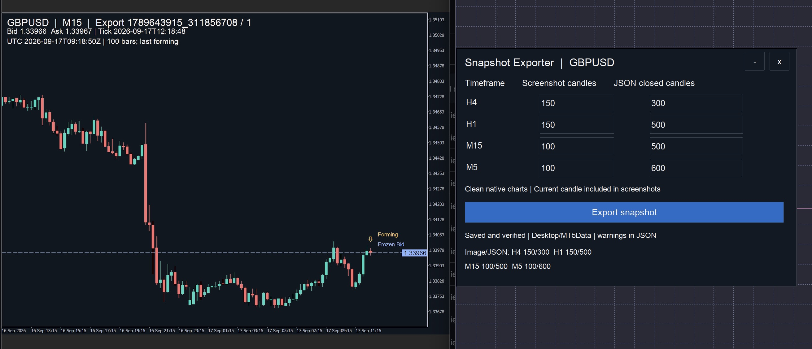

# MT5 Snapshot Exporter

A manual snapshot tool for MetaTrader 5 on macOS through Wine. It saves four native candle charts and one JSON file in **Desktop/MT5Data**. Each export gets its own folder.

The tool only reads market data, positions and pending orders for the chart's exact symbol. It does not place or manage trades, send files online, or export account identifiers.

*The panel alongside an exported chart, showing the frozen Bid, forming candle and verified candle counts.*

## Use

In MT5, open **Navigator → Scripts → MT5SnapshotExporter**, then run **MT5SnapshotExporter** on the symbol you want to export. The script displays a panel on that chart. It does not require Algo Trading.

Each timeframe has two independent fields:

| Timeframe | Screenshot candles | JSON closed candles |
|---|---:|---:|
| H4 | 100 | 300 |
| H1 | 100 | 500 |
| M15 | 100 | 500 |
| M5 | 100 | 600 |

These are starting values. Change them as needed. Valid changes are saved automatically and restored when the panel is opened again. Settings are shared by the exporter across symbols; exported data is specific to the symbol selected when the script starts.

Screenshot counts include the current, unfinished candle. JSON counts include only closed candles; the current candle is saved separately. The panel accepts 20–500 screenshot candles and up to 10,000 closed JSON candles. The JSON count must cover the screenshot.

Click **Export snapshot**. The button is unavailable while work is running. The final status shows the verified screenshot and closed JSON counts for H4, H1, M15 and M5. Drag the title bar to move the panel. Double-click the title bar, or use **− / +**, to collapse or expand it. **×** hides it; the **Snapshot Exporter** button opens it again. Position and visibility are saved.

The script must be run again after restarting MT5. It restores saved counts; it does not export automatically.

## Files and verification

Each completed folder contains H4.png, H1.png, M15.png, M5.png and snapshot.json.

The exporter prepares dedicated, clean MT5 charts. It calibrates the native screenshots using their actual candle pixels, then verifies the final PNGs again. It checks dimensions, full and partial candle counts, exact JSON counts, chronological timestamps and valid OHLC relationships. PNG checksums are checked again after copying to the Desktop. The count_verification section contains requested and saved counts.

Images are not reconstructed from JSON or resized. The right margin defaults to 12.5% and can be set between 10% and 15% in the script inputs. Native width is calculated from the candle count, zoom and margin, then calibrated against the saved image. Height defaults to 1400 pixels. Actual dimensions are recorded; ScreenshotWidth remains the reference width for reporting adjustments.

The JSON follows [snapshot.schema.json](snapshot.schema.json). Candles come directly from CopyRates; pixel checks never infer prices. Raw spread is the broker's bar field, not a reconstructed average, maximum or execution spread. Tick volume is not global Forex volume.

Each PNG shows a frozen quote with Bid, Ask, tick time and read time. A dashed line marked **Frozen Bid** and a price-scale tag identify the captured Bid. A small arrow marked **Forming** identifies the unfinished candle. The JSON contains the same quote and annotation metadata. Price fields use the symbol’s configured decimal precision and remain JSON numbers. The rightmost candle is in formation and its values can change between the JSON read and the native image capture.

The whole four-chart attempt is repeated if a current candle changes or the operational state differs at the end. The default maximum is three attempts. Current price and floating profit are excluded from the operational comparison. Sequential captures are not an atomic terminal snapshot.

## Status and time limits

- **complete**: the recorded requirements passed without warnings.
- **complete_with_warnings**: the files passed, with explicit limits in quality_warnings.
- **failed**: an essential check failed. Any retained files are an incomplete package.

This version does not claim to know the broker's UTC offset or to have independently verified the computer's clock. Server timestamps stay in their original time basis. Tick age is null with an explanation. Successful exports therefore normally have time warnings. A newly written file does not prove a fresh quote.

Positions and pending orders have separate status fields. An empty array establishes absence only when its read status is success. IDs are strings. SL and TP are null only when a successful property read reports they are unset.

Custom indicators and user drawings are not included in this first version. The existing chart's trading programs, indicators and drawings are not copied to export charts. A default template containing an Expert Advisor or script is rejected before creating temporary charts.

## Installation

Download the ZIP from [Releases](https://github.com/MaurizioPremici/mt5-snapshot-exporter/releases) and extract it. Requirements: installed MT5 Wine terminal and Python 3.11 with Pillow, NumPy and jsonschema.

From the extracted MT5SnapshotExporter folder, install the Python dependencies and the bundled compiled programs:

    python3 -m pip install -r requirements.txt
    python3 build/install.py

The ZIP includes both compiled .ex5 files. When building from the repository instead:

    python3 build/compile.py
    python3 build/compile.py src/SnapshotPanelControls.mq5
    python3 build/install.py

After first installation, right-click Navigator and choose **Refresh** so MT5 can find the panel controls indicator.

The installer copies the script and its small event-handling indicator into MT5 and installs a local LaunchAgent named local.mt5.snapshot-exporter. The helper validates files in MT5's sandbox and copies finished packages to the Desktop. It does not poll market prices, read the account or use the network. This is needed because native MQL file access is confined to its file sandbox.

Helper files: ~/Library/Application Support/MT5SnapshotExporter.
Preferences: terminal MQL5/Files/MTSE/preferences.txt.

To stop the helper:

    launchctl bootout "gui/$(id -u)/local.mt5.snapshot-exporter"

Remove its plist from ~/Library/LaunchAgents/ to prevent it starting at login. Saved Desktop exports are not removed by installation or stopping the helper.

## Technical references

- [MQL file sandbox](https://www.mql5.com/en/docs/files)
- [Native ChartScreenShot](https://www.mql5.com/en/docs/chart_operations/chartscreenshot)
- [CopyRates](https://www.mql5.com/en/docs/series/copyrates)
- [Symbol properties](https://www.mql5.com/en/docs/constants/environment_state/marketinfoconstants)
- [MqlRates](https://www.mql5.com/en/docs/constants/structures/mqlrates)
- [SymbolInfoTick](https://www.mql5.com/en/docs/marketinformation/symbolinfotick)
- [Position properties](https://www.mql5.com/en/docs/constants/tradingconstants/positionproperties)
- [Order properties](https://www.mql5.com/en/docs/constants/tradingconstants/orderproperties)

- [Native Doji candle colour](https://www.mql5.com/en/docs/standardlibrary/CChart/CChartColorChartLine)

## Release 1.2.0

Adds a smaller right margin, frozen Bid labels and a forming-candle marker. Price fields use the symbol's decimal precision. Custom candle counts, saved settings, image verification and Desktop delivery are included.

See [implemented behavior](SPEC.md) and [validation notes](VALIDATION.md) for the current scope and checks performed. This is a preview release.
